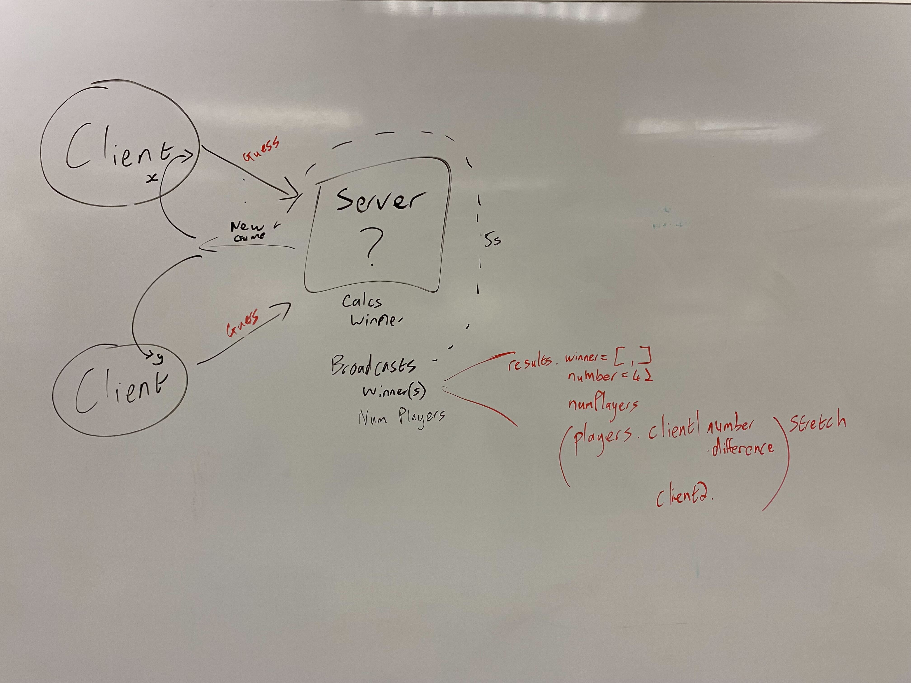
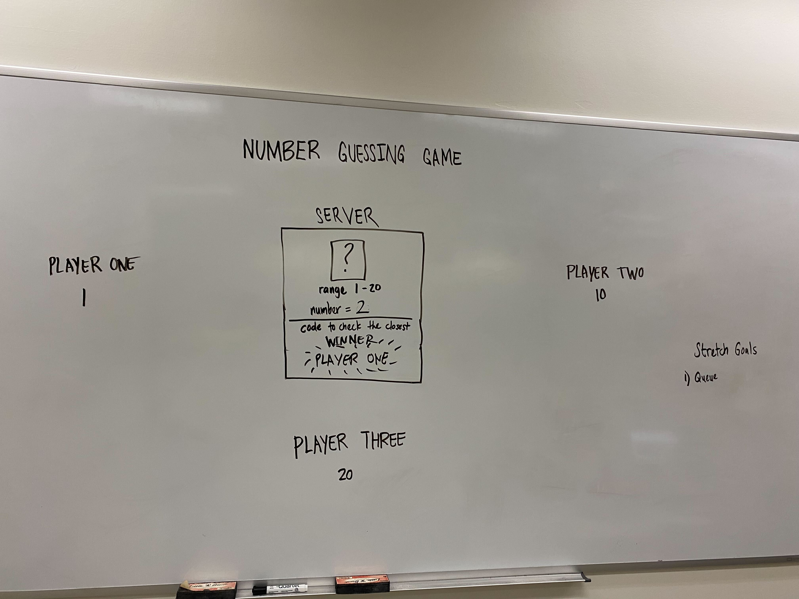

# event-driven-app

In this app, the server will guess a random number, automated clients will then guess a random number, and the one closest to that number is the winner.
This happens every 10s.

## Requirements:
A “hub” server that moderates all events
Multiple “clients” that connect to the hub which can both publish and subscribe to events
Must operate over a network

## UML

## Installation
- `npm install`
- `npm run start`: starts the server
- `npm run player1`: to start 1 client
- `npm run player2`: to start another client
- `npm run player3`: to start another client
- `npm run player4`: to start another client

## Contributions:
- David
- Chester
- Paul
- Kat

